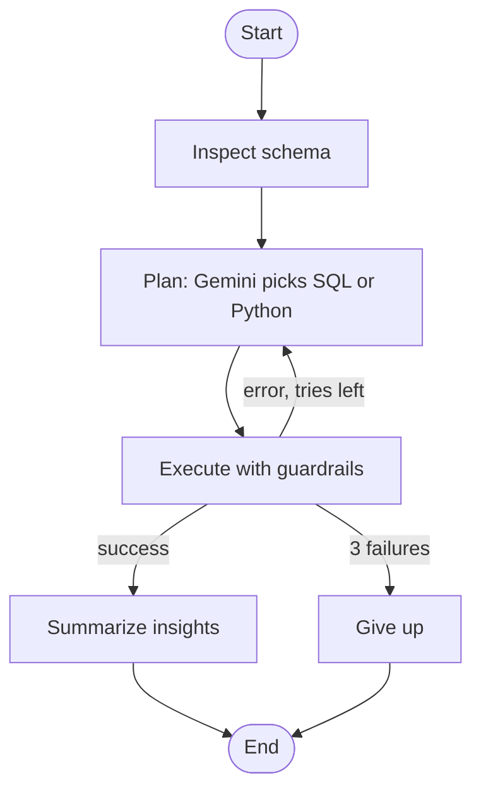

# Autonomous Data Analyst Agent

An AI agent that takes a business question in plain English, decides whether to use **SQL** or **Python (Pandas)**, runs the code, fixes its own errors, and returns a table, a chart, and a written summary.

Built with Python, Gemini API, LangGraph, SQLite, Pandas, Plotly and Streamlit.

## Features

- **Two tools, chosen by the agent:** SQL for grouping, ranking and totals; Python (Pandas) for correlations, growth rates, outliers and other analysis that is awkward in SQL
- **Self-correcting retry loop:** if the code fails, the error is sent back to the model, which fixes the code or switches tool (up to 3 attempts)
- **Read-only guardrails:** only a single `SELECT` is allowed for SQL; generated Python is checked for imports, file access and file-writing methods before it runs
- **Multi-model fallback:** if one Gemini model is overloaded or unavailable, the agent retries and then moves to another available model
- **Transparent reasoning:** the UI shows every step (schema, chosen tool, code, errors, result)
- **Automatic charts and export:** line charts for time-based results, bar charts otherwise, plus CSV download

## Architecture



## Demo: the retry loop

The agent's first attempt failed, it read the error, and corrected itself:


## Setup

**1. Clone the project and install packages**

```
git clone https://github.com/nikita200407adhau/autonomous-data-analyst-agent.git
cd autonomous-data-analyst-agent
python -m pip install -r requirements.txt
```

**2. Get a free Gemini API key** from Google AI Studio (aistudio.google.com/apikey).

**3. Set the key as an environment variable**

Windows (PowerShell):
```
$env:GEMINI_API_KEY="your_key_here"
```

Mac / Linux:
```
export GEMINI_API_KEY="your_key_here"
```

The key is read from the environment and is never stored in the code.

**4. Run the app**

```
python -m streamlit run app.py
```

Open the address shown in the terminal (usually `http://localhost:8501`), upload a CSV, and ask a question.

## Example questions

- Total sales by region
- Top 5 products by profit
- Is there a correlation between discount and profit?
- Month-over-month sales growth in 2017

## Project structure

| File | Purpose |
|------|---------|
| `app.py` | Streamlit interface |
| `graph_agent.py` | LangGraph workflow (state, nodes, edges, retry routing) |
| `agent.py` | Tools, guardrails, Gemini calls and model fallback |
| `questions.csv` | Benchmark questions with correct answers and results |
| `requirements.txt` | Python dependencies |

## Known limits

- The Python guardrail is a **static check, not a full sandbox**. It blocks imports, file access and file-writing methods, but it is meant for use on your own data. Do not expose this app to untrusted users.
- **Recommendations are AI-generated suggestions.** The table is the source of truth; the written summary may round numbers slightly differently.
- Data is loaded into an in-memory SQLite table named `data`, so very large CSV files may be slow.
- Answers depend on the model; check important numbers against a trusted source.

## Evaluation

A 20-question benchmark is being run against the Superstore dataset. Results will be added here (accuracy, and the questions the agent still gets wrong).

## Roadmap

- [x] SQL tool with read-only guardrail and retry loop
- [x] Python (Pandas) tool with static safety checks
- [x] LangGraph workflow
- [ ] 20-question benchmark and accuracy report
- [ ] Excel / PDF report export
- [ ] Live deployment on Streamlit Cloud
